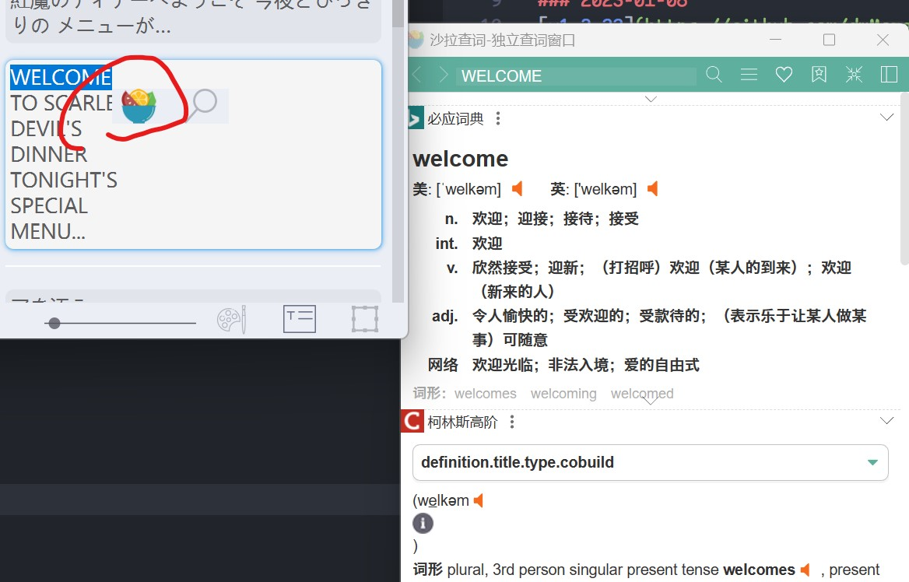

# Changelogs

### 2026-05-14
[Unreleased] robustness fixes
Changed:
1. Default page zoom now fits the current page into the visible canvas when opening a project.

Fixed:
1. Improved handling of malformed or empty LLM JSON responses.
2. Added fallback to first-step draft translations when LLM refinement fails.
3. Improved Windows robustness for atomic project saving and UI save-error handling.
4. Added diagnostics for Censor Restoration mask detection.
5. Improved simple censor bar and block mask detection.

Added:
1. Optional debug output for Censor Restoration masks and overlays.
2. Manual-mask pipeline fallback support for Censor Restoration integration code.

[v1.4.0-vibe.28] ui translations and german language
1. Extracted all new strings from recent UI updates and recompiled all `.qm` translation files.
2. Auto-translated missing UI strings for all supported languages using Google Translate.
3. Added German (`de_DE`) and Japanese (`ja_JP`) to the official translation files.
4. Updated README documentation and bumped the fork runtime version string to `1.4.0-vibe.28`.

[v1.4.0-vibe.27] page panel context menu delete data
1. Added a `Delete Page Data` context menu action to the left-sidebar page list.
2. Wired the action to safely delete textboxes, working masks, and inpainting outputs for the selected page.
3. Updated README documentation and bumped the fork runtime version string to `1.4.0-vibe.27`.

[v1.4.0-vibe.26] typesetting ui cleanups
1. Removed separate description labels from typesetting settings to reduce clutter.
2. Expanded typesetting configuration descriptions and added them as tooltips to the remaining labels and input fields.
3. Updated README documentation and bumped the fork runtime version string to `1.4.0-vibe.26`.

[v1.4.0-vibe.25] lama large inpaint mask controls
1. Added `mask_dilation_size`, `mask_dilation_kernel`, and `inpaint_enlarge_ratio` to the `lama_large_512px` Inpainter settings UI.
2. Added hover descriptions for the new LaMa Large mask and crop-context controls.
3. Applied mask dilation and configurable block crop enlargement in the inpainting runtime path.
4. Updated README documentation and bumped the fork runtime version string to `1.4.0-vibe.25`.

[v1.4.0-vibe.24] translation benchmark and lazy working folders
1. Added a Translation Benchmark window from the Run menu to compare current-page outputs from multiple translators or LLM configurations in a side-by-side table.
2. Kept benchmark translations read-only so comparing outputs does not modify project page text or saved translations.
3. Stopped creating empty `decensor_mask`, `decensored`, and disabled `upscaled` working folders during project load and normal pipeline setup.
4. Updated README documentation and bumped the fork runtime version string to `1.4.0-vibe.24`.

[v1.4.0-vibe.23] readable source language labels
1. Added English helper names in parentheses to source-language selectors in Settings and the bottom translator bar.
2. Kept translator/config values mapped to the original internal language keys so existing projects and saved configs remain compatible.
3. Updated README documentation and bumped the fork runtime version string to `1.4.0-vibe.23`.

[v1.4.0-vibe.22] remove decensor UI controls
1. Removed the Decensor section from General settings.
2. Removed the left-sidebar `Decens` button and the Run menu decensor actions.
3. Disabled automatic decensor-after-pipeline triggering during normal runs.
4. Updated README documentation and bumped the fork runtime version string to `1.4.0-vibe.22`.

[v1.4.0-vibe.21] intermediate image formats and quality
1. Added `JPG` and `WEBP` to the `Intermediate image format` setting.
2. Added a separate intermediate image quality setting independent of final result image quality.
3. Applied intermediate quality to saved masks, inpainted pages, decensor masks, and decensored working images.
4. Updated intermediate image lookup to read existing `JPG`, `JPEG`, and `WEBP` working files.
5. Updated README documentation and bumped the fork runtime version string to `1.4.0-vibe.21`.

[v1.4.0-vibe.20] real decensor mask detection
1. Removed the fallback that copied normal text/inpaint masks into the `decensor_mask` folder.
2. Expanded automatic decensor mask detection with multi-scale censor-bar detection and more tolerant mosaic-region candidates.
3. Verified the new detector creates non-empty, non-text-mask decensor masks on the reported `holo` sample pages.
4. Updated README documentation and bumped the fork runtime version string to `1.4.0-vibe.20`.

[v1.4.0-vibe.19] flux2-klein accelerate dependency
1. Added the missing `accelerate>=0.26.0` requirement needed by Diffusers when loading `flux2-klein` GGUF model parameters.
2. Added an early `flux2-klein` dependency check so old environments show a direct update/install hint instead of failing deeper inside Diffusers.
3. Updated README documentation and bumped the fork runtime version string to `1.4.0-vibe.19`.

[v1.4.0-vibe.18] decensor fallback mask creation
1. Created a fallback decensor mask when automatic decensor detection returns an empty mask.
2. Reused existing project text masks first, then text-box regions, and finally a small centered fallback region.
3. Saved the generated fallback mask to the project `decensor_mask` output before running the selected inpainter.
4. Updated README documentation and bumped the fork runtime version string to `1.4.0-vibe.18`.

[v1.4.0-vibe.17] current-page decensor worker isolation
1. Prevented current-page and all-pages decensor runs from starting on top of an active pipeline or translation worker.
2. Reused the force-stop cleanup path before decensoring so stuck LLM/background translation work cannot keep touching project state from the wrong thread.
3. Updated README documentation and bumped the fork runtime version string to `1.4.0-vibe.17`.

[v1.4.0-vibe.16] force stop for stuck runs
1. Added a `Force Stop` button next to the normal run progress `Stop` button.
2. Wired force stop to terminate active pipeline, translator, OCR, text detection, and inpainting threads when a normal stop request is stuck.
3. Reset pipeline stop flags, translation queues, inpainting state, and the progress dialog after a forced stop.
4. Updated README documentation and bumped the fork runtime version string to `1.4.0-vibe.16`.

[v1.4.0-vibe.15] LLM page context and glossary category filters
1. Added LLM context settings for previous pages, optional next-page context, capped document context pages, and maximum context characters.
2. Injected the context window into both `LLM_API_Translator` and the `Two-Step Translator` LLM refinement prompt.
3. Passed current project/page context from page translation, translation-only runs, full pipeline translation, and text-box right-click translation runs.
4. Added automatic glossary category checkboxes and changed defaults so auto extraction keeps only names and places unless more categories are enabled.
5. Updated README documentation and bumped the fork runtime version string to `1.4.0-vibe.15`.

[v1.4.0-vibe.14] page pipeline ignore toggle
1. Added page previews to the Pages sidebar list.
2. Added a page context-menu action next to `Reveal in File Explorer` for ignoring or including a page in pipeline runs.
3. Skipped ignored pages during text detection, OCR, translation, and inpainting pipeline runs while keeping manual single-page actions available.
4. Saved ignored page names in each project's `imgtrans_*.json` file under `ignored_pages`.
5. Highlighted ignored pages in the Pages sidebar and bumped the fork runtime version string to `1.4.0-vibe.14`.

[v1.4.0-vibe.13] sidebar decensor current page button
1. Added a left-sidebar `Decens` button below Pages, Search/Replace, and Glossary.
2. Wired the button to the existing current-page decensor pass so only the active page is processed.
3. Updated README documentation and bumped the fork runtime version string to `1.4.0-vibe.13`.

[v1.4.0-vibe.12] decensor pipeline pass
1. Added a `Decensor` settings section with automatic, green-mask, censor-bar, and mosaic mask modes plus mask dilation and minimum area controls.
2. Added `Decensor Current Page` and `Decensor All Pages` actions to the Run menu.
3. Added an optional `Run decensor pass after pipeline` setting so decensoring can run after normal detection, OCR, translation, and inpainting.
4. Saved generated masks and preview outputs in project-local `decensor_mask` and `decensored` folders, while updating `inpainted` so export uses the decensored image.
5. Reused the selected inpainter for reconstruction, allowing `flux2-klein` to act as an optional decensor/inpainting backend when selected.
6. Updated README documentation and bumped the fork runtime version string to `1.4.0-vibe.12`.

[v1.4.0-vibe.11] prioritized General settings labels
1. Moved the `Upscaling` and `Post-merge` settings sections to the top of General settings before `Settings presets`.
2. Restored concise visible labels for the upscale factor, maximum long edge, skip threshold, quality preset, and post-merge gap/overlap input fields.
3. Kept the longer field explanations as hover tooltips on both labels and controls.
4. Updated README documentation and bumped the fork runtime version string to `1.4.0-vibe.11`.

### 2026-05-13
[v1.4.0-vibe.10] settings polish and translation-only sidebar run
1. Removed visible labels from the upscale factor, upscale max long edge, skip upscale, upscale quality, and post-merge gap/overlap controls, moving their explanatory text to hover tooltips.
2. Tightened spacing, field height, and margins in the General > Typesetting settings so related controls take less vertical space.
3. Added a glossary icon to the left-sidebar `Gloss` button.
4. Added a second left-sidebar run button, `Trans`, that runs only translation on existing text boxes and skips text detection, OCR, and inpainting.
5. Bumped the fork runtime version string to `1.4.0-vibe.10`.

[v1.4.0-vibe.9] pre-detection page upscaling
1. Added an optional `Upscale pages before detection` setting so projects can create high-resolution working images before text detection runs.
2. Added upscale factor, maximum long-edge resolution, skip-threshold, and speed/quality presets including an `AnimeSharp`-style sharpening mode inspired by 2x-AnimeSharpV4 workflows.
3. Stored upscaled working images in a project-local `upscaled` folder and routed detection, OCR, masks, inpainting, canvas display, and export through those images when present.
4. Ignored generated `upscaled` folders in Git and bumped the fork runtime version string to `1.4.0-vibe.9`.

[v1.4.0-vibe.8] settings input wheel guard and wider fields
1. Added a `Prevent mouse wheel changes on input fields` checkbox in General settings.
2. Added a global UI guard that blocks accidental mouse wheel changes on combo boxes and spin boxes, while forwarding wheel movement to a parent scroll area when possible.
3. Enlarged long parameter fields such as API keys, endpoint URLs, proxy values, glossary prompts, and LLM prompt templates so more text is visible while editing.
4. Bumped the fork runtime version string to `1.4.0-vibe.8`.

[v1.4.0-vibe.7] project glossary UI and persistence
1. Added a left-sidebar `Gloss` button that opens a project glossary window.
2. Saved glossary entries and the custom glossary prompt in each project's `imgtrans_*.json` file.
3. Passed project glossary data into LLM translators and synchronized automatically extracted entries back to the project.
4. Added a custom `glossary prompt` setting and prompt rules that keep metadata such as `[CHARACTER]` or `[PLACE]` out of translated text.
5. Added missing tooltips for common sidebar, title bar, and module selector controls.

[v1.4.0-vibe.6] manga_ocr Transformers compatibility
1. Switched `manga_ocr` from `AutoFeatureExtractor` to `AutoImageProcessor` so the local `data/models/manga-ocr-base` vision model loads under current Transformers releases.
2. Updated the README OCR notes to explain the `Unrecognized feature extractor` failure and the supported image processor path.
3. Bumped the fork runtime version string to `1.4.0-vibe.6`.

[v1.4.0-vibe.5] LLM glossary generation and refinement
1. Added persistent glossary settings to `LLM_API_Translator` for names, places, characters, organizations, titles, and recurring terms.
2. Added automatic glossary extraction after each LLM translation batch so new source/target term pairs can be collected while translating.
3. Added a glossary refinement pass that reruns a translated batch through the LLM and aligns it with the current glossary.
4. Wired the glossary support into the `Two-Step Translator` final LLM refinement step.

[v1.4.0-vibe.4] two-step draft sidebar and request delay
1. Saved the Google/DeepL first-step result on each text block as `translation_draft`.
2. Added a read-only `First step draft` area to the text editor sidebar so the first-step machine translation can be compared with the final LLM-refined translation.
3. Added a `first step delay` setting to throttle Google/DeepL draft requests and reduce the risk of temporary provider blocking.

[v1.4.0-vibe.1] fork documentation and release identity refresh
1. Introduced the fork-aware application version `1.4.0-vibe.1` so this build is clearly distinguishable from upstream `1.4.0`.
2. Replaced the root `README.md` with the English README and refreshed the English documentation for the fork.
3. Documented the Pinokio launcher flow, the shared `./env` virtual environment, and the fork update path to `CoSciBlog/BallonsTranslator-vibe` on `dev`.
4. Recorded that this project is maintained as a Codex-expanded fork with launcher and documentation work layered on top of the upstream desktop app.
5. Added explicit disclosure that translated output and some documentation assets are machine-translated and should be labeled accordingly when republished.

### 2023-04-15
Src download implementation based on gallery-dl (#131) thanks to [ROKOLYT](https://github.com/ROKOLYT)

### 2023-02-27
[v1.3.34](https://github.com/dmMaze/BallonsTranslator/releases/tag/v1.3.34) released
1. fix incorrect orientation assignment for CHT  (#96)
2. convert CHS to CHT if it is required for Caiyun & DeepL (#100)
3. support for webp (#85)

### 2023-02-23
[v1.3.30](https://github.com/dmMaze/BallonsTranslator/releases/tag/v1.3.30) released
1. Migrate to PyQt6 for better text rendering preview and [compatibility](https://github.com/Nuitka/Nuitka/issues/251) with nuitka
2. Support set transparency of text layer (#88)
3. Dump logs to data/logs

### 2023-01-27
[v1.3.26](https://github.com/dmMaze/BallonsTranslator/releases/tag/v1.3.26) released
1. Add support for [saladict](https://saladict.crimx.com) (*All-in-one professional pop-up dictionary and page translator*) in the mini menu on text selection. [Installation guide](doc/saladict.md) 


2. Support keyword substitution for OCR & machine translation results [#78](https://github.com/dmMaze/BallonsTranslator/issues/78): Edit -> ```Keyword substitution for machine translation```
3. Support import folder with drag&drop [#77](https://github.com/dmMaze/BallonsTranslator/issues/77)
4. Hide control blocks on start text editing. [#81](https://github.com/dmMaze/BallonsTranslator/issues/81)
5. Bugfix

### 2023-01-08
[v1.3.22](https://github.com/dmMaze/BallonsTranslator/releases/tag/v1.3.22) released
1. Support delete and restore removed text
2. Support reset angle
3. Bugfixes

### 2022-12-31
[v1.3.20](https://github.com/dmMaze/BallonsTranslator/releases/tag/v1.3.20) released
1. Adapted to images with extreme aspect ratio such as webtoons
2. Support paste text to multiple selected Text blocks.
3. Bugfixes
4. OCR/Translate/Inpaint selected text blocks
   lettering style will inherit from corresponding selected block.
   ctc_48px is more recommended for single line text, mangocr for multi-line Japanese, need to retrain detection model make ctc48_px generalize to multi-lines  
   Note that if you use **ctc_48px** make sure that the box is in vertical mode and fits as close to the single line of text as possible


### 2022-11-29
[v1.3.15](https://github.com/dmMaze/BallonsTranslator/releases/tag/v1.3.15) released
1. Bugfixes
2. Optimize saving logic
3. The shape of Pen/Inpaint tool can be set to rectangle (experimental)

### 2022-10-25
[v1.3.14](https://github.com/dmMaze/BallonsTranslator/releases/tag/v1.3.14) released
1. Bugfixes

### 2022-09-30
Support Dark Mode since v1.3.13: View->Dark Mode

### 2022-09-24
[v1.3.12](https://github.com/dmMaze/BallonsTranslator/releases/tag/v1.3.12) released

1. Support global Search(Ctrl+G) and search current page(Ctrl+F). 
2. Local redo stack of each texteditor are merged into a main text-edit stack, text-edit stack is split from drawing board's now. 
3. Word doc import/export bugfixes
4. Frameless window rework based on https://github.com/zhiyiYo/PyQt-Frameless-Window

### 2022-09-13
[v1.3.8](https://github.com/dmMaze/BallonsTranslator/releases/tag/v1.3.8) released

1. Pen tool bug fixes & optimization
2. Fix scaling
3. Support making font style presets, text graphical effects(shadow & opacity), see https://github.com/dmMaze/BallonsTranslator/pull/38
4. Support word document(*.docx) import/export: https://github.com/dmMaze/BallonsTranslator/pull/40

### 2022-08-31
[v1.3.4](https://github.com/dmMaze/BallonsTranslator/releases/tag/v1.3.4) released

1. Add Sugoi Translator(Japanese-English only, created & authorized by [mingshiba](https://www.patreon.com/mingshiba)): download the [model](https://drive.google.com/drive/folders/1KnDlfUM9zbnYFTo6iCbnBaBKabXfnVJm) converted by [@Snowad14](https://github.com/Snowad14) and put "sugoi_translator" in the "data" folder.
2. Add support for russian, thanks to [bropines](https://github.com/bropines)
3. Support letter spacing adjustment.
4. Vertical type rework & text rendering bug fixes: https://github.com/dmMaze/BallonsTranslator/pull/30

### 2022-08-17
[v1.3.0](https://github.com/dmMaze/BallonsTranslator/releases/tag/v1.3.0) released


1. Fix deepl translator, thanks to [@Snowad14](https://github.com/Snowad14)
2. Fix font size & stroke bug which makes text unreadable
3. Support **global font format** (determine the font format settings used by auto-translation mode): in config panel->Typesetting, change the corresponding option from "decide by the program" to "use global setting" to enable. Note global settings are those formats shown by the right font format panel when you are not editing any textblock in the scene.
4. Add **new inpainting model**: lama-mpe and set it as default.
5. Support multiple textblocks selection & formatting. 
6. Improved manga->English, English->Chinese typesetting (**Auto-layout** in Config panel->Typesetting, enabled by default), it can also be applied to selected text blocks use the option in the right-click menu.


<p align=center>
batch text formatting & auto layout
</p>

### 2022-05-19
[v1.2.0](https://github.com/dmMaze/BallonsTranslator/releases/tag/v1.2.0) released

1. Support DeepL, thanks to [@Snowad14](https://github.com/Snowad14)
2. Add new ocr model from manga-image-translator, support korean recognition
3. Bugfixes

### 2022-04-17

[v1.1.0](https://github.com/dmMaze/BallonsTranslator/releases/tag/v1.1.0) released
1. use qthread to write edited images to avoid freezing when turning pages.
2. optimized inpainting policy
3. add rect tool
4. More shortcuts
5. Bugfixes 

### 2022-04-09

1. v1.0.0  released
