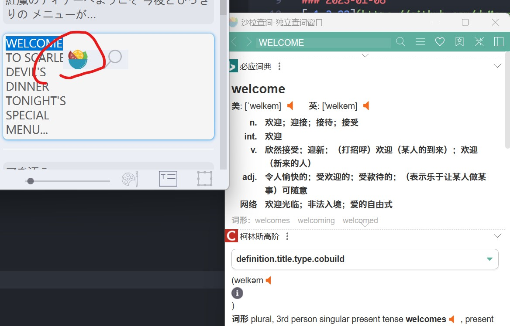
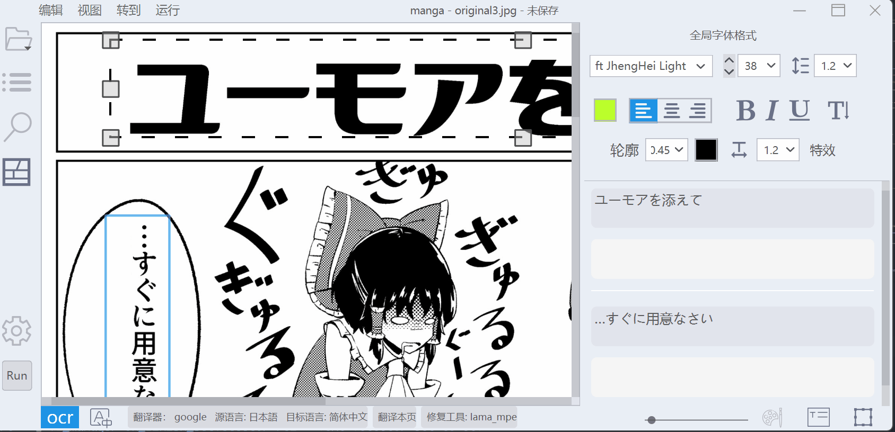
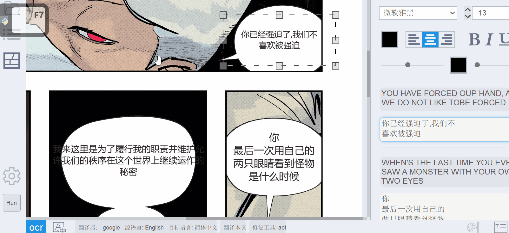

# Changelogs

### 2026-10-27 — 1.5.19+vibe.63
- Batch Processing now clears reusable LLM context after each completed project and silently skips fully completed work when Resume is enabled. An output-limited translation is retried once with only the current input and glossary, while the batch still reports one final completion message after all projects.

### 2026-10-27 — 1.5.19+vibe.62
- Batch Processing now accepts upscaling as the only enabled operation. Upscaling-only plans contain no empty pipeline tasks, so detection, OCR, inpainting, re-inpainting, and translation remain disabled throughout the batch.

### 2026-10-26 — 1.5.19+vibe.61
- Added a context-sensitive LLM profile selector to Batch Processing. Text-capable profiles can be selected for LLM translators, the chosen profile is used and logged for every project, and changing it creates a distinct resume plan while the previous global selection is restored after the batch.

### 2026-10-26 — 1.5.19+vibe.60
- Improved the initial Pipeline History column widths and made every table column freely resizable with the mouse. Manually adjusted widths are preserved when the history is refreshed.

### 2026-10-26 — 1.5.19+vibe.59
- Simplified the Tools menu to one direct **Upscale Entire Project 2x...** action. Removed the Upscaling submenu and its current-page action while retaining project and batch upscaling behavior.

### 2026-10-26 — 1.5.19+vibe.58
- Added default-off **Review and optimize translation with LLM** to every LLM profile’s Text settings. When enabled, each page draft receives a second LLM review using the source, page context, glossary, memory, and available image to improve natural wording, accuracy, pronouns, speaker/addressee references, gendered wording, and formality. Only the reviewed translation enters page history; this adds one LLM request per page.

### 2026-10-26 — 1.5.19+vibe.57
- Single-project pipelines continue to save completion per page and can resume at the failed page with **Continue**. Batch Processing now has a default-enabled **Resume** option: saved completed pages are reused immediately, while matching completed project phases and pre-upscaling tasks are recovered from an atomic checkpoint in the batch root. The checkpoint is removed after full success; disable Resume to process everything again.

### 2026-10-26 — 1.5.19+vibe.56
- Optional batch pre-upscaling now completes for every selected project folder before detection, OCR, inpainting, or translation begins in any project. The chosen per-project or staged processing order applies after this shared prerequisite, and ignored pages continue to participate only in upscaling.

### 2026-10-19 — 1.5.19+vibe.55
- Added **Settings → General → Application → Page thumbnail size** with 32, 48 (default), 64, 96, and 128 px options. The saved size applies immediately, preserves page selection and ignored status, and reloads previews in the background while discarding obsolete results. Invalid saved sizes fall back to 48 px with a warning.

### 2026-10-19 — 1.5.19+vibe.54
- Image upscaling now finishes without a success popup. Errors during upscaling or activation still display a message.

### 2026-10-18 — 1.5.19+vibe.53
- Restored sidebar page thumbnails for projects with 100 or more pages. **Settings → General → Application → Show page thumbnails** switches previews on/off immediately and remembers the choice; existing configurations default to enabled.
- Previews decode to small images in a background worker, with one decoder at a time. Page/project changes, disabling previews, and view destruction cancel obsolete work; late results cannot replace another project's thumbnails. Corrupt previews leave the page available, and toggling preserves page selection and ignored status. English/German labels and translated README guidance are included.

### 2026-10-18 — 1.5.19+vibe.52
- Added **Reset page data...** to the page context menu. After confirmation it clears only the clicked page's text boxes, OCR, translations, masks, inpainting, drawings, generated results, and processing progress, while preserving the original image, page order, and pipeline exclusion.
- Retains the previous project snapshot and generated files in a unique `.page_reset_backup_*` folder. File or save failures restore the page data; active processing/saving blocks reset, and disk IO runs in a worker. Resetting the open page clears its scene and undo history. English and German UI text is included.

### 2026-10-18 — 1.5.19+vibe.51
- Replaced the cycling `Aa` button with a labeled Text Case selector offering Normal, Uppercase, and Lowercase directly. Existing saved formatting, mixed selections, and undo retain their behavior; stored source and translation strings remain unchanged.
- Completed the selector labels and tooltip in all nine available UI languages.

### 2026-10-18 — 1.5.19+vibe.50
- Added missing English and German tooltips throughout the text-format panel, including toolbar icons, section controls, Ruby/Furigana, ligatures, effect options, eraser settings, and numeric effect/transform controls. Transform shortcut hints remain available alongside editing instructions.

### 2026-10-18 — 1.5.19+vibe.49
- Batch pre-upscaling now includes ignored pages, even when every page in a project is ignored. Text detection, OCR, inpainting, and translation continue to skip them, and their ignored status survives the upscaled file renaming.

### 2026-10-16 — 1.5.19+vibe.48
- Post-merge geometry settings remain editable while automatic pipeline merging is disabled, so manual merging can be configured independently.
- Selected text-box merging now uses the 1.4-vibe region tool's configurable direction, gap, overlap, and label predicates instead of forcing a connected selection into one box. It merges independent neighboring groups, preserves isolated boxes, and restores all original items and selection with one Undo.
- Current-page, post-pipeline, and project-wide region merging retain original group membership across both directions. Enlarged first-pass rectangles cannot bridge unrelated regions; a 0% overlap threshold still requires spatial alignment.

### 2026-10-16 — 1.5.19+vibe.47
- Restored 1.4-vibe mask expansion and residual-text detection for re-inpainting. **Run → Inpainting** now offers an elliptical expansion radius and opt-in mask optimization for current, selected, all-page, and batch re-inpainting.
- A further pass repairs detected residual text on the fresh result and adds it to the complete saved mask, preserving OCR, translations, and manual mask pixels outside text boxes. Each run starts from the original page. Expanded/combined masks are saved after successful inference; cancellation or inference failure keeps the previous files. Existing settings default to no expansion and no residual detection.

### 2026-10-14 — 1.5.19+vibe.46
- Expanded the Batch Processing parent-folder input to the full dialog width and enabled typing, pasting, and clearing paths. The folder picker remains available below the field; quoted Windows paths are supported, and changing the path discards previously discovered project folders before validation.

### 2026-10-13 — 1.5.19+vibe.45
- Fixed batch processing crashing with `ImgnameNotInProjectException` after pre-upscaling renamed source images. The page list and canvas now reload the saved project before the pipeline starts, preserving the current page and using the updated filenames for subsequent page changes.

### 2026-10-12 — 1.5.19+vibe.44
- **Re-run Inpainting Current Page/All Pages** now processes every pixel in each saved mask, including missed glyph edges and manual extensions outside OCR text-box crops.
- Re-inpainting still starts from the original page rather than compounding an earlier inpainting result.

### 2026-10-12 — 1.5.19+vibe.43
- Fixed auto-layout text boxes clipping later rendered lines when Qt required more height than the preliminary speech-bubble rectangle. The bubble remains the preferred wrapping boundary, while the final box now grows to its complete rendered content and is kept on-page when it fits.

### 2026-10-12 — 1.5.19+vibe.42
- Moved the automatic and current-page text-box merge controls from **Settings → Typesetting** to a dedicated **Settings → Post-merge** page, keeping all merge behavior and saved settings unchanged.

### 2026-10-12 — 1.5.19+vibe.41
- Restored the 1.4-vibe **Limit auto-layout boxes to speech bubbles** and **Auto layout without stored line breaks** options under **Settings → Typesetting**, adapted to the current text geometry engine.
- Automatic layout now always keeps generated boxes inside the page, can constrain them to the detected speech-bubble region, and can retain visual wrapping without saving generated hard line breaks. The existing Letter Case controls continue to provide the requested uppercase mode.

### 2026-10-12 — 1.5.19+vibe.40
- Automatic and current-page text-box merging now forms bounded local groups instead of joining an entire page through a chain of individually nearby boxes.
- The direction, maximum-gap, overlap, and label rules remain compatible with the 1.4-vibe merge behavior; every pair inside a resulting group must now satisfy them.

### 2026-10-12 — 1.5.19+vibe.39
- **Separate overlapping text boxes** now finds a joint in-page placement for the complete selection, moving the first box too when keeping it fixed would leave avoidable overlaps.
- The result continues to keep an 8 px gap from unselected boxes while preserving Undo and page-boundary protection.

### 2026-10-12 — 1.5.19+vibe.38
- The text-box merge-direction selector under **Settings → Typesetting** now sits below its description instead of extending beyond the right edge of the window.

### 2026-10-12 — 1.5.19+vibe.37
- The main window now restores its previous normal size, screen position, and maximized state instead of always starting maximized.
- Saved positions from disconnected monitors are safely moved onto the current primary screen.

### 2026-10-11 — 1.5.19+vibe.36
- Added selected-box merging to the canvas context menu and Ctrl+Alt+M shortcut, plus undoable separation with an 8 px gap within the page.
- Automatic layout no longer restores hard translation line breaks when their removal is enabled; text still wraps visually to fit the box.
- Added Run-dialog controls for re-running only inpainting from saved masks and merging compatible nearby text boxes after a successful pipeline.
- Added a visible **Project Glossary** translation option, clarified OCR letter-case behavior, and completed explanatory tooltips across the Run workflow.
- Page-range selection now resets to all pages when the active project changes while remaining remembered when reopening the Run dialog for the same project.

### 2026-10-11 — 1.5.19+vibe.35
- Sidebar text-box merging now accepts only a connected cluster of nearby regions, using a scale-aware distance threshold to avoid accidental cross-balloon merges.
- Merged regions use the union of the visible logical boxes instead of stale OCR polygons, preserving their canvas position and saved project geometry through undo/redo.
- Source and translated content now receive one blank line between each original text box.

### 2026-10-11 — 1.5.19+vibe.34
- Added profile-specific **Translate with Google First** controls for text LLM profiles, including source-language auto-detection, request delay, and safe Google-draft fallback.
- Project translation now completes and saves every Google draft before beginning any LLM refinement; selected-region translation uses the same two-step behavior within its request.
- Removed the approximate Ollama memory-estimate card and its estimation code from LLM profiles.
- Expanded OCR controls for Manga OCR, Hayai OCR, PaddleOCR-VL Manga, PP-OCRv6, and other providers, with generation, input-size, confidence, batching, and complete localized parameter guidance.
- Expanded local inpainting controls with OpenCV method/radius, PatchMatch patch size, additional neural-model resolutions through 2560 px, FLUX inference steps, and complete parameter guidance.

### 2026-10-11 — 1.5.19+vibe.33
- Extended ComicTextDetector's Detect Size selector with stride-compatible GPU resolutions through 2496 px, including 1536, 1920, 2048, 2304, and 2432 px.
- Added complete localized labels and explanations for detection resolution, split batching, device behavior, font-size controls, and mask dilation, including performance/VRAM guidance and the fixed 1024 px CPU/ONNX limitation.
- Fixed live Detect Size updates and connected Max Split Batch Size to the CTD runtime; the setting had previously been displayed and saved without being passed to the model.

### 2026-10-11 — 1.5.19+vibe.32
- Footer gear buttons now open the corresponding full Settings page for Text Detector, OCR, Inpaint, and Translator instead of the compact module-parameter popup.
- Module dropdowns and the adjacent LLM profile edit actions retain their existing behavior.
- Added regression coverage for the exact Settings section selected by every footer gear action.

### 2026-10-11 — 1.5.19+vibe.31
- Added left-sidebar buttons for re-running inpainting on the current page, opening the Glossary Manager, and opening Pipeline History.
- The shortcuts reuse the existing Tools-menu workflows, including project validation, busy-state protection, pending-edit saves, pipeline history recording, and cached manager windows.
- Added theme-aware SVG icons, localized labels and tooltips, accessibility names, and signal-level UI regression coverage for all three actions.

### 2026-10-11 — 1.5.19+vibe.30
- Added a **Merge Selected Text Boxes** button to the left sidebar. It combines two or more selected regions into one bounding box while preserving their page order.
- Source text and translations now receive one explicit line break between each original selected box. The merge invalidates geometry-bound rich text and masks safely.
- Sidebar merges are one text-history action with complete undo/redo support, restored selection, synchronized paired editors, and refreshed search results.

### 2026-10-11 — 1.5.19+vibe.29
- Added a compact `Aa` control to **Text Transform** that cycles selected text boxes and the global style through normal, lowercase, and uppercase display modes.
- Text case is a persisted, non-destructive font style: source and translated text remain unchanged, mixed selections are indicated, and changes participate in the existing text-format undo workflow.
- Headless/project-wide style application now preserves the selected text-case mode.

### 2026-10-11 — 1.5.19+vibe.28
- Changed project runs with **Two-Step (Google/DeepL + Ollama)** into two strict phases: Google or DeepL now finishes every selected page before the first Ollama refinement request starts.
- The complete first-step result is saved as a recoverable project checkpoint before Ollama begins. A checkpoint failure stops the run without starting refinement.
- Manual translation of selected text boxes keeps the immediate two-step behavior because it has no project-wide page set.

### 2026-10-11 — 1.5.19+vibe.27
- Added **Tools → Apply Current Text Style to All Pages...** to replace every project text box's formatting with the currently displayed Global Font Format, including typed effects and text transforms.
- The confirmed project-wide update preserves source and translated text, box geometry, masks, and images; only per-character rich-text style overrides are replaced.
- Successful updates save the project with a backup, immediately rebuild the current page, and reset undo history that referenced the superseded styles.

### 2026-10-11 — 1.5.19+vibe.26
- Added **Remove Existing Line Breaks...** under **Settings → Typesetting** so previously translated project text can be normalized as well as new pipeline output.
- The explicit project-wide cleanup removes persisted rich-text paragraphs that could restore old hard breaks, creates a project backup, and resets stale undo history after saving.
- Removed the duplicate compact Stroke color picker from the font toolbar; Stroke color remains available in the complete **Text Effect** controls.

### 2026-10-11 — 1.5.19+vibe.25
- Fixed glossary extraction dropping aligned translations solely because the translated text contained punctuation or expanded beyond five words.
- Automatic confirmation now leaves target-less candidates as suggestions, while later successful translations can safely fill confirmed OCR entries that are still empty.
- Added **Fill missing translations** to the Glossary Manager. It recovers empty project entries from unambiguous translated text boxes and skips conflicts, protected entries, rejected suggestions, and existing translations.

### 2026-10-11 — 1.5.19+vibe.24
- Added non-blocking Ollama reasoning-capability detection to each local LLM profile. **Detect** reads the selected model's `/api/show` metadata and displays its reported default.
- Thinking Level now offers only the exact controls advertised by that model, including boolean Enabled/Disabled controls or model-defined named levels; unsupported models are locked to Disabled and missing metadata safely uses Auto.
- Detected controls are persisted per model and use Ollama's native chat request even when the context length remains at the server default. Changing the model or endpoint invalidates stale detected choices.

### 2026-10-11 — 1.5.19+vibe.23
- Fixed the text-style preset context menu inheriting no application theme on Windows, which could leave its frameless popup transparent over the formatting controls.
- The popup now belongs to the preset panel and therefore retains the configured opaque menu background in both light and dark themes.

### 2026-10-11 — 1.5.19+vibe.22
- Added **Two-Step (Google/DeepL + Ollama)** translation: Google Translate, DeepL Free, or DeepL Pro creates the first draft and the selected local Ollama text profile reviews and refines it with the existing context, glossary, retry, and structured-response pipeline.
- Added a dedicated **Settings → Modules → Translator** page for selecting the first-step provider, entering a DeepL key, configuring request delays, and choosing whether a failed Ollama refinement keeps the machine draft.
- Ollama profile selection now remains attached to the two-step translator and filters out incompatible remote profiles. The existing **google** translator remains available as the direct Google-only path without an LLM request.

### 2026-10-11 — 1.5.19+vibe.21
- Redesigned the Ollama memory estimate as a compact themed card placed beside the relevant profile settings instead of an easily clipped sentence below the prompt editor.
- The estimated GiB range, active context length, approximate status, default state, and unavailable state are now visually separated and remain fully explained through a detailed tooltip.

### 2026-10-11 — 1.5.19+vibe.20
- Added opt-in nearby text-box merging under **Settings → Typesetting**, with direction, gap, and overlap controls plus a direct current-page action.
- Successful pipeline runs can now merge only their processed pages; ignored and unselected pages remain untouched, and the existing advanced Region Merge Tool continues to support label rules and whole-project runs.
- Consolidated the shared merge sequence and now preserves both OCR source content and translations while discarding geometry-bound rich text and masks that are invalid after regions are combined.

### 2026-10-11 — 1.5.19+vibe.19
- Added a compact Stroke color picker beside the font-color control in the main text-format toolbar, including English/German tooltips and accessibility text.
- Stroke color changes now use the existing typed effect stack and preserve width, position, opacity, blending, sibling effects, global styles, and multi-selection behavior in one undoable operation.
- Choosing a Stroke color for text without a Stroke explicitly adds the standard Stroke effect, while effect-card edits and undo/redo keep the compact picker synchronized.

### 2026-10-11 — 1.5.19+vibe.18
- Added an opt-in **Remove translation line breaks** setting under **Settings → Typesetting**. New translations can now discard model-authored hard line breaks and rely on the existing text-box layout for automatic wrapping.
- Line-break removal runs after translation conversion, keyword substitution, and letter-case processing; non-CJK lines are joined with one space while CJK lines are joined without artificial spacing.
- Existing projects retain the previous behavior by default, and existing or manually edited translations are never rewritten merely by changing the setting.

### 2026-10-11 — 1.5.19+vibe.17
- Replaced the repository's primary Chinese README with the complete English documentation so the default GitHub and package landing page is now English.
- Updated the language navigation in both English README files to avoid presenting the English main README as a Chinese translation.

### 2026-10-11 — 1.5.19+vibe.16
- Added a persisted translation-failure policy with **Retry once**, **Skip page**, and **Abort pipeline** choices in the Run dialog; the existing skip behavior remains the default.
- Fixed the inpainting CPU fallback to raise `NotImplementedError` correctly, made split `.001`/`.002` download archives extractable with explicit progress, and routed the legacy MIT48px beam entry point through the tensorized decoder cache.
- Made OpenAI Responses transport selectable for deterministic Windows tests, removed sandbox-sensitive temporary-file patterns, and retained the completed Quick Run and Ollama context/RAM controls from the preceding builds.

### 2026-10-10 — 1.5.19+vibe.15
- Added a per-profile local Ollama context length. Explicit values are sent through native `/api/chat` as `options.num_ctx` for translation and vision OCR; `0` preserves Ollama's default behavior.
- Ollama profiles now show a clearly labelled combined RAM/VRAM estimate derived from model-tag parameter count, quantization, and context length without loading a model or accessing the network.
- Standard `:11434/v1`, remote `:11434`, and native `/api/chat` endpoints are supported while retaining JSON Schema, vision input, reasoning control, and token accounting.

### 2026-10-10 — 1.5.19+vibe.14
- Added a separate sidebar quick-run button (`Ctrl+F5`) that starts the pipeline immediately with the current saved module, language, glossary, and processing settings without opening the Run dialog.
- The last Run-dialog page range is now persisted and reused by quick run, with safe defaults and clamping when the next project contains fewer pages.
- The existing `F5` button remains unchanged and continues to open the full Run dialog; the new action has a distinct lightning-marked icon and English/German accessibility text.

### 2026-10-10 — 1.5.19+vibe.13
- Upscaled source images are now renamed with their effective factor, for example `001.png` → `001_x2.png`; another 2× pass produces `001_x4.png`.
- Project page keys, indexes, current-page state, image metadata, and retained text geometry now move atomically with the renamed image, including rollback on activation or save failure.
- Added compatibility with legacy `_upscaled_2x` names and reusable integer-factor naming/scaling support for future x3, x4, and higher workflows.

### 2026-10-10 — 1.5.19+vibe.12
- Added **Tools → Pipeline History** (`Ctrl+Shift+H`) with start time, duration, status, stages, modules, and the LLM profile/model used for translation.
- Normal runs, continue/render operations, re-inpainting, complete batches, and individual batch phases are now recorded in a separate versioned, atomically written `pipeline_history.json`.
- Overall batch records live in the batch root while project phases are also recorded in their project directories; malformed history files are never silently overwritten.

### 2026-10-10 — 1.5.19+vibe.11
- Added **Tools → Re-run Inpainting Current Page/All Pages**, which reruns the selected inpainter from original pages using saved detection masks and text regions instead of compounding old inpainting results.
- Added an optional re-inpainting step to batch processing; it runs after the normal pipeline in per-project mode and remains in the local-model phase in staged mode.
- Re-inpainting respects ignored pages and reuses background cancellation, lazy module loading, project progress persistence, and English/German localization.

### 2026-10-10 — 1.5.19+vibe.10
- Added **Tools → Batch Processing** for processing every image-bearing direct child folder with selectable detector, OCR, fallback OCR, inpainter, translator, glossary scope, and optional 2× source-image upscaling.
- Added complete-project and staged execution plans. Staged mode runs local detector/OCR/inpaint work first, unloads those models, then keeps the translation model available while translating all projects.
- Added safe cancellation, project/glossary persistence, shared batch `series_glossary.json`, Windows completion actions, English/German UI text, and planning/regression tests.

### 2026-10-10 — 1.5.19+vibe.9
- Added dedicated **Text Detector**, **OCR**, and **Inpaint** pages under Settings → Modules. They share the pipeline's selected modules and persisted parameter mappings without loading models when Settings opens.
- Moved glossary behavior controls into a dedicated Modules settings page while keeping entry/source/conflict management in the Glossary Manager.
- Added complete LLM-profile duplication, default automatic source-language selection, persistent per-page pipeline exclusion, and confirmed 2× current-page/project upscaling with source replacement.
- Removed the Sponsor menu entry and added English/German strings plus offscreen and regression coverage for the new settings workflow.

### 2026-10-10 — 1.5.19+vibe.8
- Mouse-wheel input over Settings combo boxes and numeric fields now scrolls the containing settings page instead of changing values accidentally.
- Fixed `ConfigComboBox` scroll-target wiring and applied the same wheel pass-through behavior even when a field has keyboard focus.
- Added an offscreen Qt regression covering focused combo boxes, numeric fields, unchanged values, and continued page scrolling.

### 2026-10-10 — 1.5.19+vibe.7
- Added an opt-in **Unload local models before LLM requests** Pipeline setting that frees BallonsTranslator detector, OCR, translator, and inpainter models before chat, Ollama-compatible, Codex, or image LLM requests.
- LLM pipeline stages now use the existing serial low-VRAM path while the option is enabled, preventing a concurrently used local translation model from being unloaded; released modules still reload lazily when needed.
- Added validated persistence, English/German UI text, request-boundary and memory-release tests, and documentation of the external Ollama-server limitation.

### 2026-10-10 — 1.5.19+vibe.6
- Added the Phase 3 Glossary Manager with searchable CRUD, review/protection controls, JSON exchange, source management, and visible conflict resolution.
- Added reusable series and read-only reference glossaries with deterministic priorities, source tracing, safe persistence, and combined Phase 2 prompt selection.
- Added Qt-free project-context/completion APIs for future batch queues, validated glossary settings, English/German UI strings, schema and documentation, and offscreen/service tests.

### 2026-10-10 — 1.5.19+vibe.5
- Added Phase 2 automatic glossary candidate extraction with atomic deduplication, conflict reporting, review states, and cancellation-safe pipeline integration.
- Added Unicode- and alias-aware selection of confirmed project terms for LLM prompts with configurable entry/token budgets and an optional non-destructive consistency check.
- Preserved external glossary files and every non-glossary translation path; no additional LLM request or dependency is introduced.

### 2026-10-09 — 1.5.19+vibe.4
- Added the Phase 1 project-glossary backend with a versioned Unicode data model and UI-independent CRUD/search service.
- Added standalone atomic `glossary.json` persistence, autosave, external-change protection, import/export, and migration from 1.4-vibe glossaries.
- Integrated glossary creation/loading/closing with the v1.5 project lifecycle without changing project JSON.

### 2026-10-09 — 1.5.19+vibe.3
- Added JPEG and WebP options for intermediate project images.
- Added an independent intermediate-image quality setting and applied it consistently to masks and inpainted images.
- Existing intermediate images are now discovered across PNG, JPEG, WebP, and JPEG XL after changing formats.

### 2026-10-09 — 1.5.19+vibe.2
- Added complete English and German UI catalogs with a selectable German language pack.
- Display translator source and target languages with localized names while preserving stable language identifiers in saved configuration.
- Replaced hard-coded Chinese Region Merge UI text and module parameter labels with translatable English source text.
- Fixed translation extraction in uv virtual environments and added completeness, placeholder, and runtime language-pack tests.

### 2026-10-09 — 1.5.19+vibe.1
- Migrated source checkouts to a uv-managed project runtime: pinned Python, uv, cache, and dependencies now stay under `.runtime` and `.venv` instead of using a global Python installation.
- Existing virtual environments are preserved; incomplete or version-mismatched environments stop with repair guidance instead of being removed automatically.
- Added an early startup error for unsupported Python versions instead of attempting dependency repair on Python 3.13 or newer.

### 2023-04-15
Src download implementation based on gallery-dl (#131) thanks to [ROKOLYT](https://github.com/ROKOLYT)

### 2023-02-27
[v1.3.34](https://github.com/dmMaze/BallonsTranslator/releases/tag/v1.3.34) released
1. fix incorrect orientation assignment for CHT  (#96)
2. convert CHS to CHT if it is required for Caiyun & DeepL (#100)
3. support for webp (#85)

### 2023-02-23
[v1.3.30](https://github.com/dmMaze/BallonsTranslator/releases/tag/v1.3.30) released
1. Migrate to PyQt6 for better text rendering preview and [compatibility](https://github.com/Nuitka/Nuitka/issues/251) with nuitka
2. Support set transparency of text layer (#88)
3. Dump logs to data/logs

### 2023-01-27
[v1.3.26](https://github.com/dmMaze/BallonsTranslator/releases/tag/v1.3.26) released
1. Add support for [saladict](https://saladict.crimx.com) (*All-in-one professional pop-up dictionary and page translator*) in the mini menu on text selection. [Installation guide](doc/saladict.md) 


2. Support keyword substitution for OCR & machine translation results [#78](https://github.com/dmMaze/BallonsTranslator/issues/78): Edit -> ```Keyword substitution for machine translation```
3. Support import folder with drag&drop [#77](https://github.com/dmMaze/BallonsTranslator/issues/77)
4. Hide control blocks on start text editing. [#81](https://github.com/dmMaze/BallonsTranslator/issues/81)
5. Bugfix

### 2023-01-08
[v1.3.22](https://github.com/dmMaze/BallonsTranslator/releases/tag/v1.3.22) released
1. Support delete and restore removed text
2. Support reset angle
3. Bugfixes

### 2022-12-31
[v1.3.20](https://github.com/dmMaze/BallonsTranslator/releases/tag/v1.3.20) released
1. Adapted to images with extreme aspect ratio such as webtoons
2. Support paste text to multiple selected Text blocks.
3. Bugfixes
4. OCR/Translate/Inpaint selected text blocks
   lettering style will inherit from corresponding selected block.
   ctc_48px is more recommended for single line text, mangocr for multi-line Japanese, need to retrain detection model make ctc48_px generalize to multi-lines  
   Note that if you use **ctc_48px** make sure that the box is in vertical mode and fits as close to the single line of text as possible


### 2022-11-29
[v1.3.15](https://github.com/dmMaze/BallonsTranslator/releases/tag/v1.3.15) released
1. Bugfixes
2. Optimize saving logic
3. The shape of Pen/Inpaint tool can be set to rectangle (experimental)

### 2022-10-25
[v1.3.14](https://github.com/dmMaze/BallonsTranslator/releases/tag/v1.3.14) released
1. Bugfixes

### 2022-09-30
Support Dark Mode since v1.3.13: View->Dark Mode

### 2022-09-24
[v1.3.12](https://github.com/dmMaze/BallonsTranslator/releases/tag/v1.3.12) released

1. Support global Search(Ctrl+G) and search current page(Ctrl+F). 
2. Local redo stack of each texteditor are merged into a main text-edit stack, text-edit stack is split from drawing board's now. 
3. Word doc import/export bugfixes
4. Frameless window rework based on https://github.com/zhiyiYo/PyQt-Frameless-Window

### 2022-09-13
[v1.3.8](https://github.com/dmMaze/BallonsTranslator/releases/tag/v1.3.8) released

1. Pen tool bug fixes & optimization
2. Fix scaling
3. Support making font style presets, text graphical effects(shadow & opacity), see https://github.com/dmMaze/BallonsTranslator/pull/38
4. Support word document(*.docx) import/export: https://github.com/dmMaze/BallonsTranslator/pull/40

### 2022-08-31
[v1.3.4](https://github.com/dmMaze/BallonsTranslator/releases/tag/v1.3.4) released

1. Add Sugoi Translator(Japanese-English only, created & authorized by [mingshiba](https://www.patreon.com/mingshiba)): download the [model](https://drive.google.com/drive/folders/1KnDlfUM9zbnYFTo6iCbnBaBKabXfnVJm) converted by [@Snowad14](https://github.com/Snowad14) and put "sugoi_translator" in the "data" folder.
2. Add support for russian, thanks to [bropines](https://github.com/bropines)
3. Support letter spacing adjustment.
4. Vertical type rework & text rendering bug fixes: https://github.com/dmMaze/BallonsTranslator/pull/30

### 2022-08-17
[v1.3.0](https://github.com/dmMaze/BallonsTranslator/releases/tag/v1.3.0) released


1. Fix deepl translator, thanks to [@Snowad14](https://github.com/Snowad14)
2. Fix font size & stroke bug which makes text unreadable
3. Support **global font format** (determine the font format settings used by auto-translation mode): in config panel->Typesetting, change the corresponding option from "decide by the program" to "use global setting" to enable. Note global settings are those formats shown by the right font format panel when you are not editing any textblock in the scene.
4. Add **new inpainting model**: lama-mpe and set it as default.
5. Support multiple textblocks selection & formatting. 
6. Improved manga->English, English->Chinese typesetting (**Auto-layout** in Config panel->Typesetting, enabled by default), it can also be applied to selected text blocks use the option in the right-click menu.


<p align=center>
batch text formatting & auto layout
</p>

### 2022-05-19
[v1.2.0](https://github.com/dmMaze/BallonsTranslator/releases/tag/v1.2.0) released

1. Support DeepL, thanks to [@Snowad14](https://github.com/Snowad14)
2. Add new ocr model from manga-image-translator, support korean recognition
3. Bugfixes

### 2022-04-17

[v1.1.0](https://github.com/dmMaze/BallonsTranslator/releases/tag/v1.1.0) released
1. use qthread to write edited images to avoid freezing when turning pages.
2. optimized inpainting policy
3. add rect tool
4. More shortcuts
5. Bugfixes 

### 2022-04-09

1. v1.0.0  released
